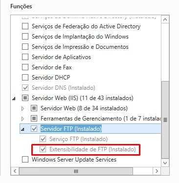
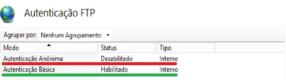
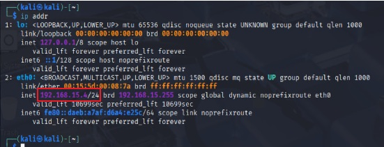

# case-study-ftp-smb-bruteforce-windows

"Case study: brute force detection and automated blocking in Windows IIS FTP environments."

This case study investigates brute force attacks targeting FTP services hosted on Windows Server with IIS. By analyzing authentication failure patterns in IIS FTP logs, we propose a practical defense mechanism implemented through PowerShell scripting and Windows Firewall automation. The solution continuously monitors log files, identifies repeated login failures, and enforces temporary IP blocking while maintaining a whitelist of trusted addresses. Results demonstrate that even without native tools like fail2ban, Windows environments can achieve effective brute force mitigation through log observability and automated response. This work represents a practical reinterpretation of intrusion detection concepts adapted to the Windows ecosystem.

Este estudo de caso investiga ataques de força bruta direcionados a serviços FTP hospedados em Windows Server com IIS. A partir da análise dos padrões de falhas de autenticação registrados nos logs do IIS FTP, propomos um mecanismo prático de defesa implementado por meio de scripts em PowerShell e automação do Windows Firewall. A solução monitora continuamente os arquivos de log, identifica tentativas repetidas de login e aplica bloqueios temporários de IP, mantendo ao mesmo tempo uma lista de endereços confiáveis (whitelist). Os resultados demonstram que, mesmo sem ferramentas nativas como o fail2ban, ambientes Windows podem alcançar uma mitigação eficaz contra brute force através da observabilidade dos logs e da resposta automatizada. Este trabalho representa uma releitura prática dos conceitos de detecção de intrusão adaptados ao ecossistema Windows.

**Keywords:** Information Security; Brute Force Attacks; FTP; IIS; Windows Server; PowerShell; Automation; Firewall; Case Study.

**Palavras-chave:** Segurança da Informação; Ataques de Força Bruta; FTP; IIS; Windows Server; PowerShell; Automação; Firewall; Estudo de Caso.

##Ambiente Experimental / Ambiente de Testes

Para simular o ataque de brute force em FTP, foram utilizadas máquinas virtuais configuradas da seguinte forma:

- **Servidor alvo (Windows Server 2012 R2 com IIS FTP)**
  - Sistema operacional: Windows Server 2012 R2
  - Função instalada: IIS FTP Server

  - Usuários configurados para autenticação via Active Directory (verde) e inativação da autenticação anônima (vermelho)

- **Máquina atacante (Linux Kali)**
  - Sistema operacional: Kali Linux 2025.2
  - Ferramentas utilizadas: `nmap`, `medusa`
  - Rede: mesma sub-rede da VM alvo (rede interna Microsoft Hyperv)
    

- **Máquina Cliente**
  - Sistema operacional: Windows 11 24h2
  - Função: Testes de conexão para serviços FTP, SBM e RDP (após obtenção da senha)

##Metodologia
 
🔍 Identificando o IP no Kali Linux
No Kali (ou em qualquer distribuição Linux), usamos o comando em um terminal:

-> ip addr

 
