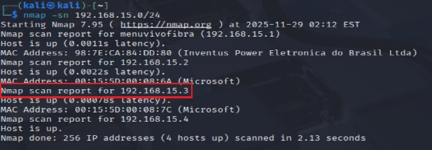
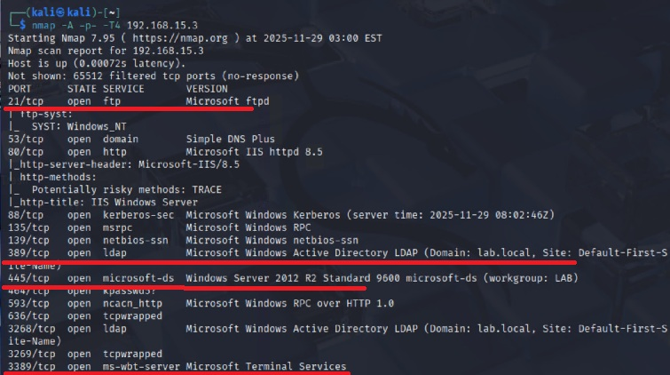
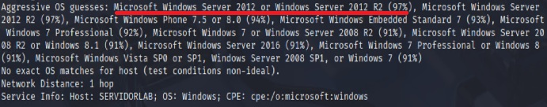
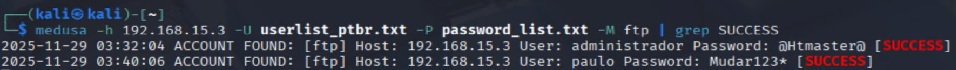
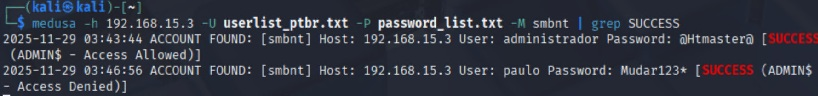

📂 Case Study: FTP & SMB Brute Force in Windows
<br>

Case study: brute force detection and automated blocking in Windows IIS FTP environments.
<br>
---
<br>
Este estudo de caso investiga ataques de força bruta direcionados a serviços FTP hospedados em Windows Server com IIS. A partir da análise dos padrões de falhas de autenticação registrados nos logs do IIS FTP, propomos um mecanismo prático de defesa implementado por meio de scripts em PowerShell e automação do Windows Firewall, assim como o hardning nas configurações do ISS.

A solução:

- Monitora continuamente os arquivos de log
- Identifica tentativas repetidas de login
- Aplica bloqueios temporários de IP
- Mantém uma whitelist de endereços confiáveis

Os resultados demonstram que, mesmo sem ferramentas nativas como o fail2ban, ambientes Windows podem alcançar uma mitigação eficaz contra brute force através da observabilidade de configurações de segurança (hardening) ou utilização de scripts próprios.

<br>

🔑 Keywords / Palavras-chave

<br>

Keywords: Information Security; Brute Force Attacks; FTP; IIS; Windows Server; PowerShell; Automation; Firewall; Case Study.

Palavras-chave: Segurança da Informação; Ataques de Força Bruta; FTP; IIS; Windows Server; PowerShell; Automação; Firewall; Estudo de Caso.

<br>

🖥️ Ambiente Experimental / Experimental Environment
<br>
---
<br>

Para simular o ataque de brute force em FTP, foram utilizadas máquinas virtuais configuradas da seguinte forma:

<br>

🔹 Servidor Alvo
-SO: Windows Server 2012 R2
-Função instalada: IIS FTP Server


Configuração:

-Autenticação via Active Directory (verde)
-Autenticação anônima desativada (vermelho)


<br>

🔹 Máquina Atacante
-SO: Kali Linux 2025.2
-Ferramentas: nmap, medusa
-Rede: mesma sub-rede da VM alvo (rede interna Hyper-V)

<br>

🔹 Máquina Cliente
-SO: Windows 11 24h2
-Função: Testes de conexão para serviços FTP, SMB e RDP (após obtenção da senha)

<br>

⚙️Metodologia / Methodology
<br>
---
<br>

🔍 Identificando o IP no Kali Linux
No Kali (ou em qualquer distribuição Linux), usamos o comando: ip addr


<br>

🌐 Scaneando a rede
Para identificar os possíveis hosts ativos com o comando: nmap -sn 192.168.15.0/24



<br>

📖 Explicação dos parâmetros:

<br>

nmap → ferramenta de mapeamento de rede

-sn → ping scan, apenas verifica hosts ativos

192.168.15.0/24 → intervalo de endereços da rede (255.255.255.0 → .1 até .254)

<br>

📊 O que o comando faz Percorre todo o segmento de rede e retorna uma lista de hosts online.

<br>

🔍 Escaneando o host alvo:
Após identificar o host 192.168.15.3, realizamos um scan completo com o comando: nmap -A -p- -T4 192.168.15.3

<br>

📖 Explicação dos parâmetros

-A → modo agressivo (OS detection, versão de serviços, scripts NSE, traceroute)

-p- → escaneia todas as 65.535 portas TCP

-T4 → timing rápido e confiável para redes locais

192.168.15.3 → IP do host alvo

<br>

📊 O que o comando faz:

<br>

-Verifica todas as portas abertas

-Identifica serviços e versões

<br>



<br>

-Descobre o sistema operacional



<br>

🔑 Criação da Password List / Password List Creation
<br>
---
<br>

Para simular ataques de força bruta contra o serviço FTP, foi criada uma lista de senhas personalizada utilizando Python. O script foi executado no Google Colab, permitindo edição e execução rápida em ambiente online.

<br>

📜 Script em Python

<br>

```python
# Script para gerar lista de senhas

# Nome do arquivo de saída
arquivo = "password_list.txt"

# Padrões de símbolos
padroes = [
    "{}*",
    "{}@",
    "@{}@",
    "*{}*",
    "*{}@",
    "@{}*"
]

# Sufixos comuns (anos)
letras = ["2010", "2011", "2012", "2013", "2014", "2015",
          "2016", "2017", "2018", "2019", "2020", "2021",
          "2022", "2023", "2024", "2025"]

# Senhas padrão conhecidas
senhas_padrao = [
    "admin", "Admin", "password", "Password", "root", "htmaster", "Htmaster",
    "123", "1234", "12345", "123456", "1234567", "12345678", "123456789",
    "100senha", "100senh@", 
    "Mudar123", "Mudar1234", "Mudar12345","Mudar123456",
    "mudar123", "mudar12345", "mudar123456", 
    "a1b1c1d1", "a1b2c3d4"
]

# Criar lista e salvar no arquivo
with open(arquivo, "w") as f:
    # 1. Senhas padrão puras
    for senha in senhas_padrao:
        f.write(senha + "\n")
    
    # 2. Senhas padrão com máscaras
    for senha in senhas_padrao:
        for p in padroes:
            f.write(p.format(senha) + "\n")
    
    # 3. Senhas padrão com anos adicionados
    for senha in senhas_padrao:
        for letra in letras:
            f.write(senha + letra + "\n")
            f.write(letra + senha + "\n")
            f.write(letra + senha + letra + "\n")
    
    # 4. Senhas padrão + anos + máscaras
    for senha in senhas_padrao:
        for letra in letras:
            for p in padroes:
                f.write(p.format(senha + letra) + "\n")
                f.write(p.format(letra + senha) + "\n")
                f.write(p.format(letra + senha + letra) + "\n")

print(f"Lista gerada com sucesso em: {arquivo}")
```

<br>

📖 Explicação:

<br>

- senhas_padrao → contém senhas comuns (admin, root, 123456, mudar123 etc.).

- letras → adiciona anos como sufixos/prefixos (2010–2025), simulando padrões reais de usuários.

- padroes → aplica símbolos como *, @ em diferentes posições, aumentando a complexidade.

- Loops → combinam senhas padrão com anos e símbolos, gerando centenas de variações automaticamente.

- Saída → todas as combinações são salvas em password_list.txt.

<br>

📊 Resultado:

<br>

O arquivo final password_list.txt contém uma lista extensa de senhas que imita padrões reais de usuários.

<br>

👤 Criação da User List / User List Creation
<br>
---
<br>

Além da lista de senhas, também foi necessário criar uma lista de nomes de usuários para simular tentativas de login em serviços FTP e SMB. Essa lista foi construída em Python e executada no Google Colab, garantindo flexibilidade e reprodutibilidade.

<br>

📜 Script em Python

<br>

```python
# Script para gerar arquivos de nomes em ptbr

# Lista de nomes comuns no Brasil
nomes = [
    "admin", "administrador", "administrator", "root", "adm", "htmaster", "convidado", "guest", 
    "ana", "maria", "joao", "jose", "pedro", "paulo", "carlos", "lucas",
    "gabriel", "rafael", "mateus", "miguel", "rodrigo", "fernando", "bruno",
    "juliana", "camila", "patricia", "beatriz", "carla", "renata", "andre",
    "felipe", "gustavo", "daniel", "thiago", "marcos", "claudia", "silvia"
]

# Nome do arquivo de saída
arquivo = "userlist_ptbr.txt"

# Gerar combinações
with open(arquivo, "w") as f:
    for nome in nomes:
        # Nome puro
        f.write(nome + "\n")
    for i in range(len(nomes)):
        for j in range(len(nomes)):
            if i != j:
                # Nomes compostos com diferentes separadores
                f.write(f"{nomes[i]}.{nomes[j]}\n")

print(f"Lista gerada com sucesso em: {arquivo}")
```

<br>

📖 Explicação:

<br>

- Lista nomes → contém usuários comuns em ambientes brasileiros, incluindo nomes genéricos (admin, root, guest) e nomes pessoais (ana, joao, maria, etc.).

- Arquivo de saída → userlist_ptbr.txt, onde todos os nomes são gravados.

- Primeiro loop → grava cada nome puro em uma linha.

- Segundo loop → gera combinações de nomes compostos com separador . (ex.: ana.maria, joao.pedro).

- Resultado final → centenas de combinações de nomes, simulando cenários reais de usuários em sistemas corporativos e domésticos.

<br>

📊 Resultado:

<br>

- O arquivo userlist_ptbr.txt contém:

- Usuários genéricos (admin, root, guest).

- Nomes pessoais comuns no Brasil.

- Combinações compostas (ana.maria, carlos.lucas, juliana.camila).

<br>

🚀 Importância no estudo:

<br>

- Realismo: simula nomes de usuários comuns em ambientes brasileiros.

- Escopo ampliado: combinações compostas aumentam a superfície de ataque.

- Integração prática: lista de usuários + lista de senhas → ataques de brute force mais completos.

<br>

⚔️ Ataque de Força Bruta com Medusa / Brute Force Attack with Medusa
<br>
---
<br>

Após a criação das listas de usuários (userlist_ptbr.txt) e senhas (password_list.txt), foi realizado o ataque de força bruta contra o serviço FTP do host alvo (192.168.15.3) utilizando a ferramenta Medusa.

<br>

📜 Comando utilizado: medusa -h 192.168.15.3 -U userlist_ptbr.txt -P password_list.txt -M ftp | grep SUCCESS

<br>

📖 Explicação dos parâmetros:

- medusa → ferramenta de brute force rápida e modular, usada para testar credenciais em diversos serviços.

-h 192.168.15.3 → define o host alvo (IP do servidor FTP).

-U userlist_ptbr.txt → arquivo contendo a lista de usuários gerada em Python.

-P password_list.txt → arquivo contendo a lista de senhas gerada em Python.

-M ftp → especifica o módulo FTP, ou seja, o serviço contra o qual o ataque será realizado.

| grep SUCCESS → filtra a saída do Medusa, mostrando apenas as tentativas que tiveram sucesso (credenciais válidas).

<br>

📊 O que o comando faz:

<br>

- O Medusa percorre todas as combinações possíveis entre os usuários e senhas fornecidos.

- Para cada tentativa, ele tenta autenticar no serviço FTP do host alvo.

- Se alguma combinação for válida, a saída mostrará a linha com a palavra SUCCESS.

- O uso do grep SUCCESS garante que apenas os resultados positivos apareçam, facilitando a identificação das credenciais corretas.

<br>

📌 Saida do ataque:

<br>



<br>

⚔️ Ataque de Força Bruta com Medusa (SMBNT) / Brute Force Attack with Medusa (SMBNT)
<br>
---
<br>

📜 Comando utilizado: medusa -h 192.168.15.3 -U userlist_ptbr.txt -P password_list.txt -M smbnt | grep SUCCESS

<br>

📖 Explicação dos parâmetros:

- medusa → ferramenta de brute force modular.

-h 192.168.15.3 → IP do host alvo (Windows Server).

-U userlist_ptbr.txt → lista de usuários criada em Python.

-P password_list.txt → lista de senhas criada em Python.

-M smbnt → módulo SMB/NTLM, usado para autenticação em compartilhamentos de arquivos Windows (SMB).

<br>

Diferente do -M ftp, aqui o ataque é direcionado ao serviço de compartilhamento de arquivos do Windows.
Esse módulo tenta autenticar contra o Server Message Block (SMB), protocolo usado para acesso a pastas compartilhadas, impressoras e outros recursos de rede.

<br>

| grep SUCCESS → filtra a saída para mostrar apenas credenciais válidas encontradas.

<br>

📊 O que o comando faz:

- Percorre todas as combinações de usuários e senhas.

- Tenta autenticar no serviço SMB do host alvo.

- Se alguma combinação for válida, aparece a linha com SUCCESS.

- O filtro grep SUCCESS mostra apenas os resultados positivos.

<br>

📌 Saida do Comando:

<br>



<br>

🚀 Importância no estudo:

<br>

- Mostra que o ataque não se limita ao FTP: SMB também é vulnerável a brute force.

- Reforça a necessidade de monitorar múltiplos serviços (FTP, SMB, RDP) em ambientes Windows.

- Justifica o uso do script de defesa para bloquear IPs após tentativas repetidas, protegendo não só o FTP mas também outros serviços críticos.

## - A visualização das mesmas senhas nos 2x protocolos diferentes evidencia o uso do Active Directory como database para as contas de usários.

<br>

🛡️ Mitigação Simples para os ataques de força bruta / Simple Mitigation for Brute Force Attacks
<br>
---
<br>

O script desenvolvido implementa uma defesa básica contra ataques de brute force direcionados aos serviços FTP e SMB em sistemas Windows. A lógica é inspirada em soluções como Fail2Ban, amplamente utilizadas em ambientes Linux, mas adaptada para o ecossistema Windows utilizando PowerShell e o Windows Firewall.

<br>

🔍 Funcionamento:

<br>

- Monitoramento contínuo

- O script executa em loop infinito, analisando periodicamente:

- Os logs do IIS FTP, identificando falhas de login registradas com o código 530.

- Os eventos de segurança do Windows (ID 4625), que representam tentativas de logon mal-sucedidas, incluindo ataques SMB.

- Identificação de IPs suspeitos

- Cada falha é associada ao endereço IP remoto.

- O script mantém um contador de falhas por IP.

- Quando o número de falhas ultrapassa o limite configurado (threshold), o IP é classificado como potencial atacante.

- Bloqueio automático

- O script cria uma regra no Windows Firewall bloqueando todas as conexões de entrada do IP suspeito.

- O bloqueio é temporário: após o tempo definido (blockTime), a regra é removida automaticamente, permitindo que o endereço volte a se conectar.

- Registro em log

- Todas as ações (bloqueio e desbloqueio) são registradas em arquivo próprio (fail2banwin_log.txt), garantindo rastreabilidade e auditoria.

- Robustez contra ausência de eventos

- Caso não haja logs FTP ou eventos SMB no período analisado, o script não interrompe sua execução. Ele apenas informa que não encontrou registros e continua rodando, aguardando novas tentativas.

<br>

⚙️ Configurações principais

- threshold: número de falhas antes do bloqueio (ex.: 5).

- blockTime: tempo de bloqueio em minutos (ex.: 60).

- whitelist: lista de IPs confiáveis que nunca devem ser bloqueados.

<br>

✅ Benefícios

<br>

- Mitigação imediata: bloqueia automaticamente IPs que insistem em tentativas inválidas.

- Automatização: reduz tempo de resposta sem necessidade de intervenção manual.

- Baixo custo: utiliza apenas recursos nativos do Windows (PowerShell + Firewall).

- Flexibilidade: parâmetros ajustáveis conforme o nível de tolerância desejado.

- Complementaridade: adiciona uma camada extra de proteção, funcionando em conjunto com outras soluções de segurança.

<br>
##👉 Em resumo, este script representa uma defesa simples, eficaz e de baixo custo contra ataques de força bruta, aproveitando logs e eventos já disponíveis no Windows para identificar tentativas repetidas de login e aplicar bloqueios temporários de forma automática.
<br>

```powershell
# Veja o script completo em:
# [https://github.com/usuario/repositorio/blob/main/Fail2BanWin.ps1](https://github.com/PauloBettin/case-study-ftp-smb-bruteforce-windows/blob/main/Fail2BanWin.ps1)

<br>


